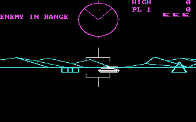

Bezug zum Film
==============
Verrohung der Gesellschaft
Exzessive Gewaltdarstellung im Fernsehen
Publikum jubelt „Gamern“ zu

Definition Gewalt
=================

Um eine erste Übersicht zu bekommen was überhaupt Gewalt ist sind nachfolgend zwei Definitionen aufgeführt:

§ 131 StGB (Gewaltdarstellung): 
>Wer Schriften (§ 11 Abs. 3), die grausame oder sonst unmenschliche Gewalttätigkeiten gegen Menschen oder menschenähnliche Wesen in einer Art schildern, die eine Verherrlichung oder Verharmlosung solcher Gewalttätigkeiten ausdrückt oder die das Grausame oder Unmenschliche des Vorgangs in einer die Menschenwürde verletzenden Weise darstellt,[...]wird mit Freiheitsstrafe bis zu einem Jahr oder mit Geldstrafe bestraft.

Definition nach Brockhaus:
>„Gewalt, die Anwendung von physischem oder psychischem Zwang gegenüber Menschen. Gewalt umfasst 1) die rohe, gegen Sitte und Recht verstoßende Einwirkung auf Personen (lateinisch violentia), 2) das Durchsetzungsvermögen in Macht- und Herrschaftsbeziehungen (lateinisch potestas) \[…\]“

Gewaltdarstellung in Videospielen
=================================

Ein zentrales mittel vieler Computerspiele basieret auf dem kompetativen Wettstreit. Also dem gegenseitigen messen wer besser ist.
Als eines der ersten Videospiele, welches nach deutschem Recht indexiert wurde gilt die 1984 erschienene Panzersimulation „Battle Zone“. Die Darstellung von Gewalt war in diesen frühen Anfängen noch sehr limitiert. Doch die Angst vor einer militärischen Auseinandersetzung der beiden Supermächte war mitte der Achtziger noch sehr aktuell. 

Knapp zehn Jahre später hat sich mit der ersten Version von „Doom“ die Grafik deutlich weiterentwickelt.
Aufgrund der für die damalige Zeit realistischen Gewaltdarstellung, hat sich die BPjM 1993 für eine Aufnahme in die Liste der jugendgefährdenen Medien entschieden. Verglichen mit dem deutlich später erschienenen „Doom 3“ (2004) des selben Herstellers, wirkt die Darstellung der Gewalt in „Doom“ aus heutiger Sicht harmlos. „Doom 3“ ist auch nicht indiziert worden.

2011 „Battlefield 3“

BPjM
====

Sind Menschen, menschenähnliche Wesen oder aber andere Geschöpfe Opfer der virtuellen Gewalt?
Was ist die Motivation, (ethische) Begründung bzw. Legitimation der virtuellen Gewalt?
Wird das Computerspiel insgesamt durch Mord- und Metzelszenen geprägt?
Ist die Darstellung der Gewalt im Computerspiel selbstzweckhaft und detailliert?
In wieweit wird die Distanzierung vom virtuellen Spielgeschehen vermindert oder gefördert?
Spieler wird die Wahl gelassen ob er Gewalt anwendet oder nicht.
Wichtiges Unterscheidungsmerkmal zum Film ist die direkte Beteiligung

Erklärungsansätze
=================

*Die Katharsistheorie*

Ausgehend von der Triebtheorie Sigmund Freuds, geht diese Theorie von einem dem Menschen angeborenen Aggressionstrieb aus. Demnach entsteht im Menschen permanent aggressive Energie, die bestrebt ist, sich nach außen zu entladen und auf diese Weise abzureagieren. Nach der Katharsistheorie bewirken Gewaltdarstellungen in den Medien, dass beim Rezipienten der Antrieb zur Ausführung eigener gewalttätiger Handlungen abgebaut wird. Die Medien schaffen dem Rezipienten demnach durch stellvertretende Gewalterlebnisse ein Ventil, das eine psychische Reinigungsfunktion erfüllt. (2)

*Die Inhibitionstheorie*

Alternativ zur Katharsistheorie wurde die Inhibitionstheorie entwickelt. Sie stützt sich gezielt auf den ebenfalls in Freuds Triebtheorie enthaltene Aspekt der Hemmung, die für einen Aggressionsausbruch zunächst überwunden werden muss. So wird laut Inhibitionstheorie durch die Beobachtung von Gewaltdarstellungen nicht innere Aggression abgebaut, sondern Aggressionsangst ausgelöst. Durch diese Angst wird beim Rezipienten die eigene Aggressionsbereitschaft gehemmt. (3)

*Die Theorie der kognitiven Unterstützung*

Eine weitere Variante der Katharsistheorie bildet die kognitive Unterstützungstheorie. Nach ihr wird durch die Medien (insbesondere bei Menschen mit niedriger Intelligenz und schwacher Einbildungskraft) die Phantasie der Rezipienten angeregt. Durch mediale Gewaltdarstellungen wird die Fähigkeit zur Kontrolle der eigenen Aggressionen kognitiv unterstützt. (4)

*Die Stimulationstheorie*

In der Stimulationstheorie wird eine der Katharsistheorie widersprechende Auffassung vertreten. Gewaltdarstellungen haben demnach keine Ventilfunktion, sondern führen im Gegenteil zu einer aggressiven Aufladung. Die Theorie hat zur Grundlage, dass Medieninhalte in der Lage sind beim Rezipienten gefühlsmäßige Erregungen zu bewirken. Nach der Stimulationstheorie wird somit durch Gewaltdarstellungen die Aggressivität des Rezipienten gesteigert und seine Gewaltbereitschaft erhöht. Aber auch nicht-gewalttätige Inhalte (wie zum Beispiel erotische Darstellungen) können Aggressionen auslösen, sofern sie durch entsprechende Umweltreize stimuliert werden. (5)

**Die Habitualisierungstheorie**

Die Grundüberlegung der Habitualisierungstheorie ist, dass eine dauerhafte Veränderung von Einstellungen kaum durch einzelne Medienereignisse bewirkt werden kann. Daher werden in dieser Theorie langfristige Wirkungen betont. Demnach stumpft der Rezipient bei ständiger Konfrontation mit fiktiver Mediengewalt nicht nur allmählich gegenüber diesen Gewaltdarstellungen ab. Nach der Habitualisierungstheorie führt das wiederholte Beobachten fiktiver Gewalt auch zu einer Gewöhnung an reale Gewalt. Dies kann dazu führen, dass der Rezipient Gewalt als normale Alltäglichkeit und als Mittel zur Konfliktlösung ansieht. Längerfristig werden also Wandlungen der Persönlichkeitsstruktur und der Moralauffassungen des Rezipienten befürchtet. (6)

Quelle http://www.stefre.de/html/gewaltwirkungsforschung.html

Studien
=======
