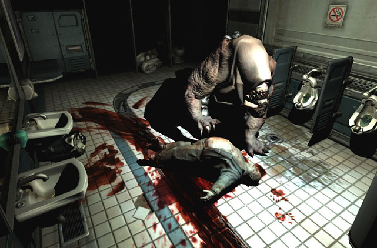
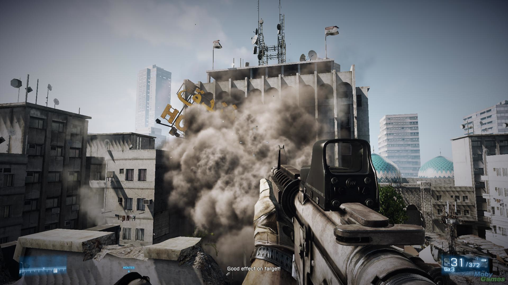

Bezug zum Film
==============
* Verrohung der Gesellschaft
* Exzessive Gewaltdarstellung im Fernsehen
* Publikum jubelt „Gamern“ zu

Definition Gewalt
=================

Die komplexe Definition des Wortes „Gewalt“ kann sowohl positiv als auch negativ behaftet sein. Es gibt zum einen die legitime herschende Gewalt und zum anderen die verletzende Gewalt. Aufgrund der immer besserer grafischer Möglichkeiten verlaufen, die Grenzen zwischen realer und fiktiver Gewalt, unterschiedliche Moral- und Wertvorstellungen führen zu unterschiedlichen Auffassungen von legitimer und illegitimer Gewalt. Um die Definition zu konkretisieren, sind nachfolgend zwei Definitionen von Gewalt aufgeführt. 

Der Paragraph § 131 StGB definiert eine Gewaltdarstellung als: 
>Wer Schriften (§ 11 Abs. 3), die grausame oder sonst unmenschliche Gewalttätigkeiten gegen Menschen oder menschenähnliche Wesen in einer Art schildern, die eine Verherrlichung oder Verharmlosung solcher Gewalttätigkeiten ausdrückt oder die das Grausame oder Unmenschliche des Vorgangs in einer die Menschenwürde verletzenden Weise darstellt,\[...\]wird mit Freiheitsstrafe bis zu einem Jahr oder mit Geldstrafe bestraft.

Definition nach Brockhaus:
>„Gewalt, die Anwendung von physischem oder psychischem Zwang gegenüber Menschen. Gewalt umfasst 1) die rohe, gegen Sitte und Recht verstoßende Einwirkung auf Personen (lateinisch violentia), 2) das Durchsetzungsvermögen in Macht- und Herrschaftsbeziehungen (lateinisch potestas) \[…\]“

Auffälig ist, dass sich nach beiden Definitionen, Gewalt immer gegen Menschen oder menschenähnliche Wesen zu richtet.

Gewaltdarstellung in Videospielen
=================================

Ein zentrales mittel vieler Computerspiele basieret auf dem kompetativen Wettstreit. Also dem gegenseitigen messen welcher Spieler besser ist. Dieses Mittel führt dazu, dass heute viele Spiele diesen Wettkampf mit Gewaltdarstellungen visualisieren. Schön früh in der Geschichte der Videospiele kam es zu Aufnahmen in die Liste der jugendgefärdenden Medien. Die folge einer sogenaten „Indizierung“ sind sowohl ein Verkaufs- und Vertriebsverbot für jugentliche unter 18 Jahren, als auch ein generelles Werbeverbot. Ein Eintrag besteht grundsätzlich für 25 Jahre, es kann aber bereits nach 10 Jahren durch den Hersteller eine erneute Überprüfung beantragt werden.
Als eines der ersten Videospiele, welches nach deutschem Recht indexiert wurde gilt die 1984 erschienene Panzersimulation „Battle Zone“. Die Darstellung von Gewalt war in diesen frühen Anfängen noch sehr limitiert. Doch die Angst vor einer militärischen Auseinandersetzung der beiden Supermächte war mitte der Achtziger noch sehr aktuell. 
  

  
   
  <i>Battle Zone</i>
  

Knapp zehn Jahre später hat sich mit der ersten Version von „Doom“ die Grafik deutlich weiterentwickelt.
  

  
   
  <i>Doom</i>
  

Aufgrund der für die damalige Zeit realistischen Gewaltdarstellung, hat sich die BPjM 1993 für eine Aufnahme in die Liste der jugendgefährdenen Medien entschieden. Verglichen mit dem deutlich später erschienenen „Doom 3“ (2004), welches nicht indiziert worden ist, wirkt die Darstellung der Gewalt in „Doom“ aus heutiger Sicht für die BpJM harmlos.

 
<i>Doom 3</i>

 An diesem Beispiel zeigen sich die gewandelten Moralvorstellungen der BpJM stellvertretend für die Gesellschaft. Auch kriegerische Darstellungen scheint man heute wesentlch toleranter gegenüberzustehen. Wie die Gegenüberstellung des ersten Beispiels „Battle Zone” mit einem aktuellen Kriegsshoter „Battlefield 3“ (2011, nicht indiziert) zeigt.

 
<i>Battlefield 3</i>

Ein wichtiges Unterscheidungsmerkmal von Videospielen gegenüber Filmen ist die direkte Beteiligung. Dies ist kann zum einen als Nachteil gewertet werden, da der Spieler die Handlungen selbst ausführt und somit stärker mit der Gewaltausführung verbunden ist. Es kann aber auch als Vorteil gesehen werden, wenn dem Spieler beispielsweise die Wahl gelassen ob er Gewalt anwendet oder nicht.

BPjM
====

Die BPjM hat sehr differenzierte Richtlinien um die jugendgefährdung von Computerspielen zu bewerten.

* Sind Menschen, menschenähnliche Wesen oder aber andere Geschöpfe Opfer der virtuellen Gewalt?
* Was ist die Motivation, (ethische) Begründung bzw. Legitimation der virtuellen Gewalt?
* Wird das Computerspiel insgesamt durch Mord- und Metzelszenen geprägt?
* Ist die Darstellung der Gewalt im Computerspiel selbstzweckhaft und detailliert?
* In wieweit wird die Distanzierung vom virtuellen Spielgeschehen vermindert oder gefördert?

Erklärungsansätze
=================

Um die möglichen Auswirkungen virtueller Gewalt zu erklären gibt es unterschiedliche Erklärungsansätze, wobei keine eine vollumfassende Theorie darstellt.

###Die Katharsistheorie

Ausgehend von der Triebtheorie Sigmund Freuds, geht diese Theorie von einem dem Menschen angeborenen Aggressionstrieb aus. Der Mensch lädt sich demnach kontinuierlich mit aggressiver Energie auf. Dise innere Aggression ist bestrebt, sich nach außen zu entladen. Ein Mittel für diese Entladung ist demnach beispielsweise die Gewaltdarstellung in Videospielen. Die Ausführung virtueller Gewalt würde demnach dem Spieler ein Ventil für seine Aggression bieten und demnach eine „psychische Reinigungsfunktion“ erfüllen.

###Die Inhibitionstheorie

Ebenfalls ausgehend von der Triebtheorie Freuds wurde die Inhibitionstheorie, als Alternative zur Katharsistheorie entwickelt. Dabei wird davon ausgegangen, das für einen Aggressionsausbruch zunächst eine innere Hemmung überwunden werden muss. Beim konsum gewalthaltiger Computerspiele würde so laut der Inhibitionstheorie eine innere Hemmung aufgebaut und so Aggressionsangst ausgelöst. Die Bereitschaft eines Gewaltausbruchs würde so bei dem konsumenten gehemmt. 

###Die Theorie der kognitiven Unterstützung

Eine weitere Variante der Katharsistheorie stellt die kognitive Unterstützungstheorie dar. Grundlage dieser Theorie ist, dass die Phantasie der Konsumenten angeregt wird. Dies soll insbesondere für Menschen mit niedriger Intelligenz und schwacher Einbildungskraft zutreffen. Durch die Darstellung der Gewalt solle die Kontrolle über die eigene Aggression kognitiv unterstützt werden.

###Die Stimulationstheorie

Entgegen der Kartasistheorie, vertritt die Stimulationstheorie die entgegengesetzte Auffassung. Anstelle einer Ventilfunktion, füre der konsum gewalthaltieger Videospiele zu einer sich immer weiter steigertenden aggressiven Aufladung. Grundlage der Theorie ist, dass gewaltätige Darstellungen eine gefühlsmäßige Erregung beim Rezipienten bewirken sollen.

###Die Habitualisierungstheorie

Bei der Habitualisierungstheorie wird davon augegangen, dass eine Steigerung der Gewaltbereitschaft nicht auf einzelne Medienereignisse zurückzuführen ist. Dieser Ansatz betont daher die langfristigen Wirkungen. Demnach stumpft der Spieler durch die Konfrontation mit fiktionaler Gewalt allmälich gegenüber dieser ab. Außerdem führe das wiederholte Beobachten fiktiver Gewalt auch zu einer Gewöhnung an reale Gewalt. Die Gefahr besteht das der Konsument das Mittel Gewalt immer weiter als alltägliches Mittel zur Lösung von Konflikten ansieht. Es wird befürchtet, dass sich die Persönlichkeitsstruktur und die Moralauffassung des Spielers mit der Zeit anpassen.

Quelle http://www.stefre.de/html/gewaltwirkungsforschung.html

Studien
=======

Viele Studien über die Wirkung gewalthaltiger Computerspiele sind wiedersprüchlich oder methodisch nicht korrekt. Eine aktuelle Metastudie zu dem Thema kam zu dem Ergebniss, das 59 Prozent dieser Studien wissenschaftlich validierten Kriterien entspricht. 

>Publication bias was a problem for studies of aggressive behavior, and methodological problems such as the use of poor aggression measures inflated effect size. Once corrected for publication bias, studies of media violence effects provided little support for the hypothesis that media violence is associated with higher aggression. The corrected overall effect size for all studies was r = .08.

http://www.jpeds.com/article/S0022-3476(08)01037-8/abstract

